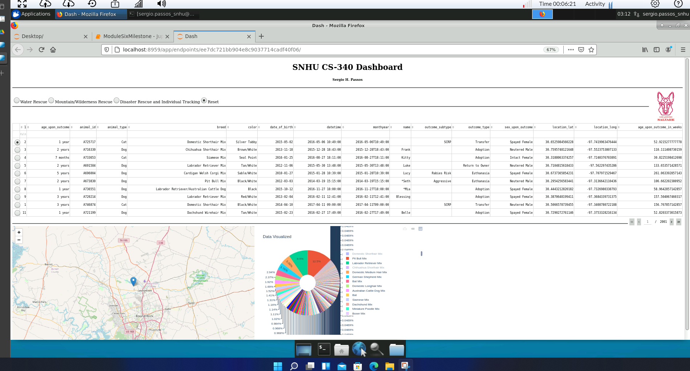
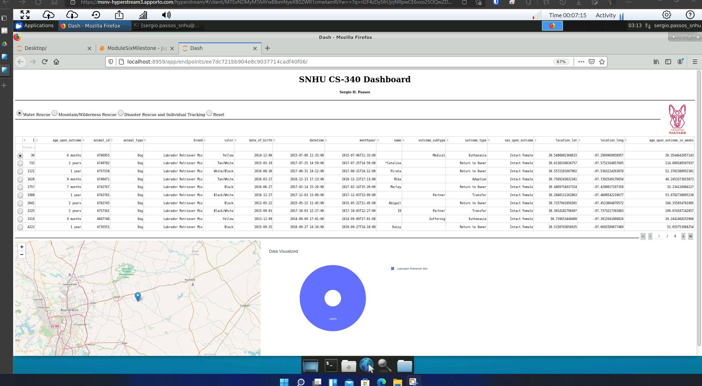
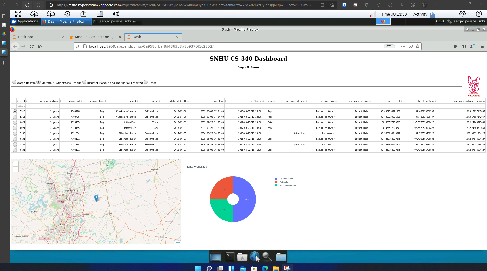
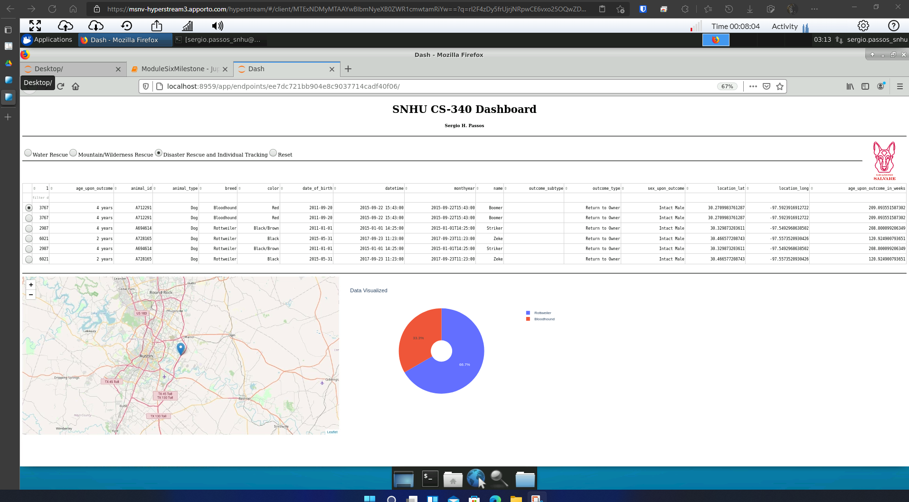
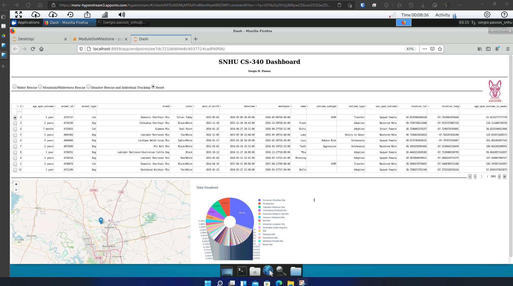

# Animal-Rescue-Interactive-Database-Jupyter-Dashboard
> The dashboard utilizes a database to populate a data table and applies an interactive map and pie chart to visually help the user understand the data. Additionally, the dashboard has built in filter that can either but toggled or written to better traverse the data. 

## Table of Contents
* [General Info](#general-information)
* [Technologies Used](#technologies-used)
* [Features](#features)
* [Screenshots](#screenshots)
* [Steps](#steps)
* [Obstacles](#obstacles)
* [Questions](#questions)
* [Project Status](#project-status)

## General Information
> This was a final project for CS-340 Client/Server Development. This project was to have a better understanding of MongoDB, Python, and Jupyter Notebook. Weaving together these three technolgies to solve a problem. The client finds capable animals and trains them for search and rescue. This dashboard allows the client to quickly view the data and filter the data based on what the client is looking for.

## Technologies Used
- MongoDB - shell version 4.2.6
- Jupyter Core - version 4.5.0
- Juypter-Notebook - version 6.0.1
- Python - version 3.6.9
- PyMongo - version 3.12.0

## Features
List the ready features here:
- Data table for displaying the data from the database
- Pie chart for visualizing the data
- Map for visualizing the data

## Screenshots

## Steps
- Setting up the MongoDB database and administrator access for data manipulation
- Installing Jupyter Notebook
- Installing Python
- Designing and creating a CRUD object for interfacing with the MongoDB database in Python
- Testing that Python object and ensuring successful interaction with the database
- Designing the Dash application in Jupyter Notebook
- Testing the Dash application with the CRUD object, ensuring that the data is being collected and displayed properly.

## Obstacles
- Designing the Dash application was proven to be slightly challenging. Since it needs good web development understanding of Javascript, HTML, and CSS.
- MongoDB has a “_id” field that uses a custom Object to represent the value. This object wasn’t playing nicely with the data table—Dash component—which made it again slightly difficult to debug.  

## Questions
- How do you write programs that are maintainable, readable, and adaptable? Especially consider your work on the CRUD Python module from Project One, which you used to connect the dashboard widgets to the database in Project Two. What were the advantages of working in this way? How else could you use this CRUD Python module in the future?

  Preplanning is essential of writing programs that are maintainable, readable, and adaptable. A good example is how I implemented the CRUD object in Python. Breaking down every component and working on them indivudally, debuging, and testing. Additionally, diagrams and comments also help complete the picture of writing great code.

- How do you approach a problem as a computer scientist? Consider how you approached the database or dashboard requirements that Grazioso Salvare requested. How did your approach to this project differ from previous assignments in other courses? What techniques or strategies would you use in the future to create databases to meet other client requests?

  My approach was to first understand the problem. View it from multiple angles and see how the pieces of the project could possibly fit together. Then comes the planning phase, creating diagrams for the database, and the system. Additionally, researching appropriate technology to be utilized is esential in not only solving the problem, but elevating it. Getting the database up and running came first for the implementation. Next, the CRUD Python script for interacting with the database. Finally, creating the dashboard application and setting up the user experience. All while testing every component along the way, ensuring a smooth transition to the finish line of the project.

- What do computer scientists do, and why does it matter? How would your work on this type of project help a company, like Grazioso Salvare, to do their work better?

  Computer scientist are problem solvers. They take a problem and apply various technology to solve the problem.

## Project Status
Project is: _complete_
